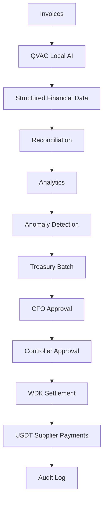

# Vantage Enterprise

Privacy-first enterprise treasury copilot for companies with multiple branches, subsidiaries, and departments.

Vantage Holdings finance teams receive hundreds of supplier invoices each month. Vantage processes those documents locally, reconciles them to purchase orders, flags unusual spending, and moves approved USDT supplier payments through Tether WDK — with dual-control governance and a complete audit trail.

**QVAC** is the financial intelligence layer.  
**Vantage** is the governance and orchestration layer.  
**WDK** is the settlement layer.

Financial documents never need to leave your infrastructure. Invoice OCR, extraction, and analysis run locally with QVAC. Wallet secrets never reach the browser. Payment commands run server-side. The application defaults to WDK `--dry-run`.

---

## Problem

Medium and large companies must:

- process invoices at scale
- attribute spend to the correct branch
- reconcile invoices to purchase orders
- detect anomalous spending
- require more than one officer to release funds
- settle suppliers in USDT
- keep an auditable history

Cloud AI APIs and custodial crypto dashboards are a poor fit for sensitive financial documents and treasury controls.

## Solution

Vantage is a single Next.js application that:

1. Accepts invoice uploads (PNG, JPG, PDF)
2. Processes them locally with QVAC (or a deterministic demo extractor)
3. Reconciles totals, suppliers, and branches to purchase orders
4. Calculates branch anomalies with a deterministic formula (not an LLM)
5. Uses QVAC only to explain anomalies in plain language
6. Collects CFO + Controller approvals inside Vantage
7. Executes or dry-runs USDT payments through the WDK CLI
8. Writes every sensitive action to an audit log

## Architecture



Everything runs as one Next.js app plus optional local QVAC and WDK tooling. There are no microservices.

## Privacy model

- Invoice files are stored under a local `uploads/` directory with generated names.
- QVAC processing is local (SDK OCR and/or the QVAC OpenAI-compatible HTTP server on loopback).
- No OpenAI, Anthropic, Gemini, or other external cloud AI APIs are used.
- UI copy states that documents are processed locally with QVAC.

## Security model

- Uploads are validated by extension and MIME type, capped at 10 MB, and stored with random filenames (no path traversal).
- WDK commands are built as argument arrays and executed with `execFile` on the server only.
- Seed phrases and wallet passwords are never stored in source, the database, or the frontend.
- Demo role switching is **not** production authentication. Production should use enterprise SSO/RBAC.
- Dual approval is an application governance layer implemented by Vantage. WDK does not provide this workflow.
- Default payment mode is dry-run / demo. Simulated hashes use a `demo_tx_` prefix and are not chain confirmations.

## Approval model

Required roles: **CFO** and **Controller**.

A payment batch needs 2 of 2 distinct roles. The same role cannot approve twice. Demo users:

| Name | Role |
| --- | --- |
| Elena Castro | Finance Analyst |
| Maria Rodriguez | CFO |
| Daniel Vega | Controller |

Finance Analysts can upload and review. Only CFO/Controller can approve or execute.

## QVAC integration

Adapter: `lib/qvac.ts`

| Function | Purpose |
| --- | --- |
| `checkQvacHealth()` | Probe the local HTTP server (`QVAC_BASE_URL/models`) and optional `@qvac/sdk` |
| `processInvoice(filePath)` | OCR + field extraction |
| `extractInvoiceFields(text)` | JSON extraction validated with Zod |
| `explainAnomaly(anomaly)` | Human-readable explanation after deterministic detection |

Official surfaces used:

- QVAC HTTP server: `qvac serve openai` → `http://localhost:11434/v1` (`/models`, `/chat/completions`)
- QVAC SDK OCR (when `@qvac/sdk` is installed): `loadModel`, `ocr`, `OCR_LATIN`, `unloadModel`

PDFs: official OCR operates on images. This MVP does not invent a PDF API. PDF page-to-image conversion is an adapter TODO.

If QVAC is unavailable and `DEMO_MODE=true`, `lib/qvac-demo.ts` runs a delayed deterministic extractor. The UI flow is identical.

## WDK integration

Adapter: `lib/wdk.ts` (server-side only)

Documented CLI used:

```bash
wdk get address --network ethereum --wallet vantage-treasury
wdk get balance --network ethereum --wallet vantage-treasury --json
wdk send --network ethereum --to DESTINATION --amount AMOUNT --token USDT --wallet vantage-treasury --dry-run --json
```

Command construction is isolated in `buildWdkCommand()` so flag order can be adjusted without touching business logic.

**Never use a funded production wallet during development.**

## Anomaly detection

`lib/anomaly.ts` is deterministic:

```
deviationPercent = ((currentSpend - historicalAverage) / historicalAverage) * 100
```

Flag if `currentSpend > historicalAverage * 1.25`.

| Deviation | Severity |
| --- | --- |
| 25%–35% | medium |
| 35%–50% | high |
| > 50% | critical |

Seeded Cartago spend is $54,730 versus a $41,700 baseline (~31.2%, high).

## Demo mode

`DEMO_MODE=true` (default) keeps the hackathon demo working without QVAC or WDK installed.

`WDK_DRY_RUN=true` (default) never broadcasts payments.

| Layer | REAL | DEMO | DRY-RUN |
| --- | --- | --- | --- |
| Dashboard, invoices, reconciliation, anomalies, approvals, audit | Yes | Seeded data | — |
| QVAC OCR / completion | When SDK or `qvac serve openai` is running | Deterministic extractor | — |
| WDK address / send | When `wdk` CLI is installed and dry-run is off | Simulated `demo_tx_*` | `--dry-run` preview, no broadcast |

## Local setup

```bash
npm install
cp .env.example .env
npx prisma generate
npx prisma db push
npx tsx prisma/seed.ts
npm run dev
```

App URL: [http://127.0.0.1:43123](http://127.0.0.1:43123)

### Environment variables

See `.env.example`:

```
DATABASE_URL="file:./dev.db"
DEMO_MODE=true
QVAC_BASE_URL=http://localhost:11434/v1
WDK_WALLET_NAME=vantage-treasury
WDK_NETWORK=ethereum
WDK_TOKEN=USDT
WDK_DRY_RUN=true
```

### Prisma

```bash
npx prisma generate
npx prisma db push
npx tsx prisma/seed.ts
```

SQLite file: `prisma/dev.db`.

### How to run QVAC (optional)

```bash
npm install -g @qvac/cli
qvac serve openai --port 11434
# Official OCR / completion via @qvac/sdk requires a local model load.
# See https://docs.qvac.tether.io/
```

Health check: open `/api/health`. `qvac` is `online` when the HTTP server answers, otherwise `demo` when `DEMO_MODE=true`.

### How to verify WDK (optional)

```bash
npm install -g @tetherto/wdk-cli
wdk wallet create --name vantage-treasury
wdk get address --network ethereum --wallet vantage-treasury
wdk get balance --network ethereum --wallet vantage-treasury --json
wdk send --network ethereum --to 0x000000000000000000000000000000000000dEaD --amount 0.001 --token USDT --wallet vantage-treasury --dry-run --json
```

Do not point this app at a funded production wallet.

## Hackathon demonstration sequence

1. Open **Dashboard**. Confirm total spend ≈ $187,430, pending payments $42,670, 128 invoices, Cartago anomaly.
2. Open **Invoices**. Drop files or use **Load 24 sample invoices**.
3. Watch **Processing locally with QVAC** and batch progress.
4. Confirm invoices populate with branch, supplier, and amounts.
5. Return to **Dashboard**. Metrics and recent invoices update.
6. Cartago remains / appears anomalous (~31% above baseline).
7. Read the QVAC or deterministic explanation.
8. Open **Treasury**. August Supplier Payments, 14 suppliers, 42,670 USDT.
9. Seed data already records **CFO approval** (Maria Rodriguez). Switch role to **Controller**.
10. Approve. Status becomes **2 / 2** and batch **READY**.
11. Click **Execute Payments**, confirm the modal.
12. Watch sequential WDK progress (Processing → Dry run / Demo transaction + `demo_tx_…`).
13. Open **Audit Log**. Trace uploads → QVAC → anomaly → approvals → execution.

To demonstrate CFO approval live, skip relying on the seed: a Controller-only pending batch still needs the second role. The seeded batch already has the CFO signature so the demo can complete with a single Controller click.

## Known limitations

- Demo authentication is a role cookie, not SSO.
- `@qvac/sdk` is optional; OCR model download is not bundled.
- PDF rasterization is not implemented.
- WDK JSON output parsing is defensive because CLI JSON shapes can vary by version.
- Destination addresses are labeled test identifiers.
- ERC-4337 smart accounts, batch UserOperations, and paymasters are **not** implemented.

## Future architecture (not in this MVP)

WDK EVM **ERC-4337 Smart Accounts** could later:

- batch supplier payments into a single UserOperation
- use a paymaster for gasless USDT settlement
- keep the same Vantage approval gate in front of the bundler

That path is an extension point only. This MVP uses classic WDK CLI `send` with `--dry-run` by default.

## License

Hackathon MVP. Not for production treasury use.
